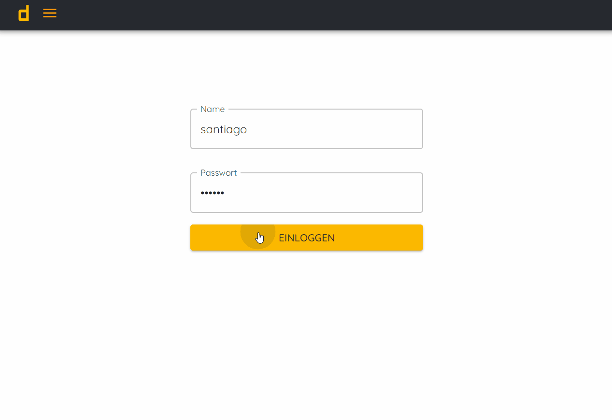
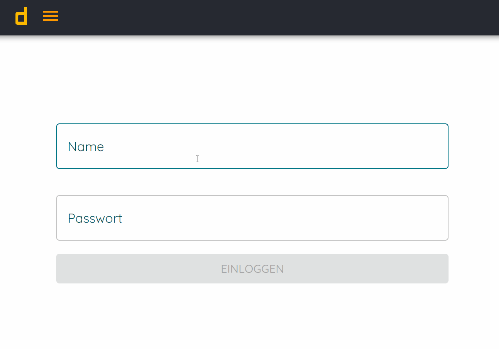
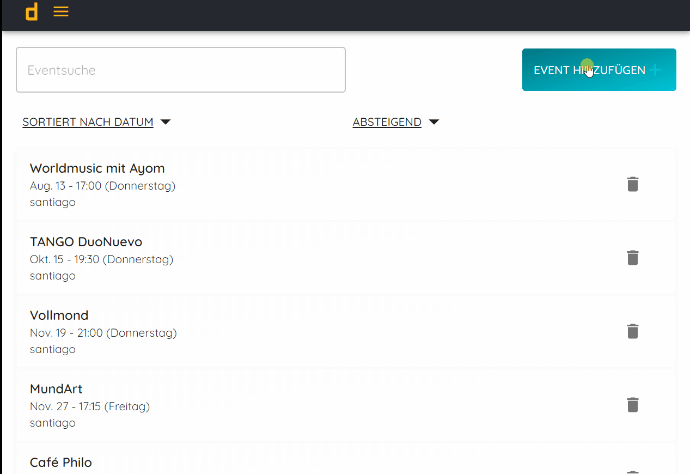
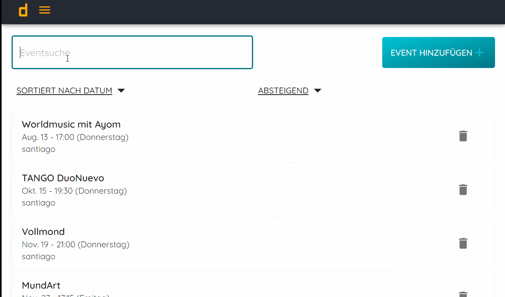
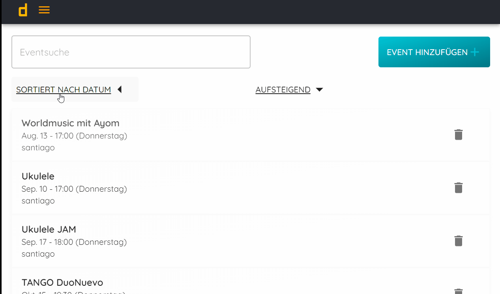

<h1>
Single Page Application (SPA) using ReactJS, Mongoose, Passport, NodeJS
</h1>
<h2>Event tracking App System</h2>

this project consists of a web application for the registration and monitoring of events. The
project is divided into frontend (client side) and backend (server side)

<h3>Frontend</h3>

Single Page Application created with <u>ReactJS,material-ui and styled 
components</u>

<h3>Backend</h3>

The application uses passportjs for authentication. The database has been created using the nosql 
MongoDB database, namely mongoose.

<h3>Functionalities<h3/>
<h4>Authentication</h4>

The application uses the JSON Web Token (JWT) standard in order to login and check authenticity 
of active sessions of logged-in users.

<h4>Creation, update and deletion of events</h4>

Once logged in, the user (administrator type) can create, update or delete previously created events.

<h4>Queries</h4>

Existing events can be searched and/or sorted by date of creation, event or creator name

